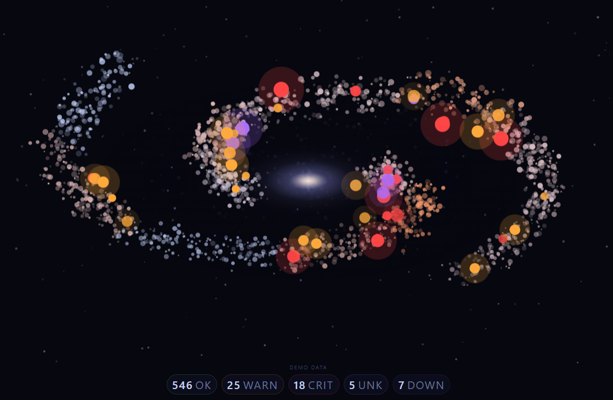

# Icinga Galaxy



Visualize the health of various Icinga system checks in the form a spiral galaxy. Both host and service checks are modeled as stars within the galaxy arms and will change colors, grow, and shrink, based on their state. 

## Install

This is a two part install, the web app and the poll check script. The web app can be run on it's own from a desktop computer in demo mode. Demo mode creates mock data and exposes a control panel for testing. This is a good way to see how the visualization works. 

For deployment copy the `index.html`, `styles.css` and `galaxy.js` files to a web server. No backend code framework is required since everything runs on Javascript. When hit with a browser the script will attempt to load the `sensors.json` file and decrypt data using the `key=` hash. If it doesn't exist the demo interface will again be shown. 

```
Example url: https://localhost:8000/index.html#key=mykeyhere
```

To get live Icinga data run the `poll_icinga.py` script. You must authenticate to an Icinga server via a valid [api user](https://icinga.com/docs/icinga-2/latest/doc/09-object-types/#apiuser) with `objects/query/*` permissions. Specific check sources can be set via the `--check_source` flag. The `--key` argument must be used to encrypt data when running in production as the `index.html` file expects an encrypted file. Use `-h` to see a full list of options. The polling script will output the `sensors.json` file necessary to pull in data from the Icinga system. Set up a cron task to periodically update this file. 

```
# generate an insecure (plaintext) file
python3 poll_icinga.py --url https://localhost:5665 --username user --password pass --check_source master 

# generate an secure (encrypted) file
python3 poll_icinga.py --url https://localhost:5665 --username user --password pass --check_source master --key mykeypass
```

## Usage

Once running simply load the `index.html` page in a browser. Refer to the __kiosk__ folder for more information on running this as a headless system via a Raspberry Pi in kiosk mode. 

The `poll_icinga.py` file is designed to be run via cron, or other scheduler, and update the sensor data periodically. Pick an interval that makes sense for you and use the `--out` argument to push the to a place it can be loaded by the browser. 

### Mock Data Generation

The `generate_mock_data.py` script exists to generate a sample `sensors.json` file for use in testing. This can be used in lieu of an actual Icinga connection to make sure the full stack is working. 

### Advanced Grouping Options

When collecting Icinga hosts and services, Icinga groups are used to sort the checks into the spiral arm clusters. By default the first group in the list is used when sorting. Sometimes this is not ideal as a host, and it's services, can be a part of many groups. Using the `--groups` argument with `poll_icinga.py` specific target groups can be specified. If a host doesn't exist in one of these groups it is considered "ungrouped". This allows greater control over the number of clusters, and their members. 

```
# 4 clusters created: windows, linux, switches, and ungrouped
python3 poll_icinga.py --url https://localhost:5665 --username user --password pass --check_source master --groups windows-servers --group linux-servers --groups network-switches

```

### Visualization Rules

When running the following visualization rules are applied based on the Icinga host and service states. 

* Sensors are grouped into clusters within the spiral bands - Icinga group names are used
* Critical states create a red star
* Warnings create a yellow star
* Unknown creates dark blue stars
* Down hosts are illustrated with a dark gray color 
* Unacknowledged, or not in downtime, sensors are larger with a halo effect

As more systems fail within a grouped cluster that portion of the spiral will start to expand and flare. After 50% of the group, or 10 sensors max, are in a non-OK state the large colored stars are not shown but instead the overall cluster will start to fail. Down hosts contract the arm instead of flaring. If most of the hosts are down the galaxy will appear dark and dead. If most of the hosts are in a non-OK state the galaxy will appear as if it's exploding red/orange. 

## Credits

Portions of this codebase were developed with AI assistance (code generation and suggestions), followed by substantial human review, editing, and revision.

## License 

[AGPLv3](/LICENSE)

